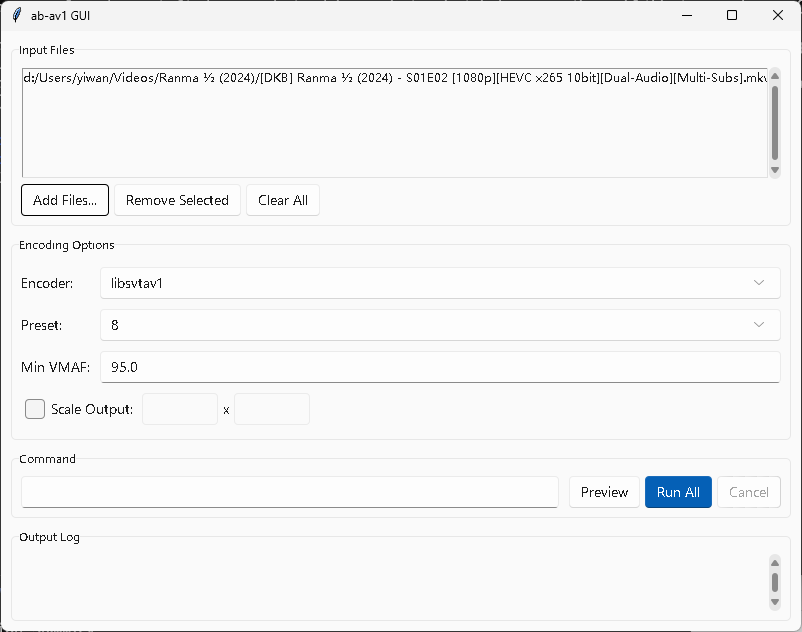

# ab-av1 GUI

A graphical user interface for the [ab-av1](https://github.com/alexheretic/ab-av1) video encoder front-end.

This application provides an easy-to-use interface for `ab-av1`, allowing users to perform video encodes without using the command line. It supports batch processing, various encoders, and quality-based encoding (VMAF).



## Features

-   **User-Friendly Interface**: Simplifies the `ab-av1` encoding process.
-   **Batch Processing**: Encode multiple files at once.
-   **Drag and Drop**: Easily add files to the queue.
-   **Multiple Encoders**: Supports a wide range of encoders, including:
    -   `libsvtav1` (AV1)
    -   `libx264` (H.264), `libx265` (H.265/HEVC)
    -   `libvpx-vp9` (VP9)
    -   Intel Quick Sync Video (QSV) encoders for AV1, HEVC, H.264
    -   NVIDIA NVENC encoders for AV1, HEVC, H.264
-   **Quality-Based Encoding**: Target a specific VMAF score for consistent quality.
-   **Customizable Presets**: Select presets tailored to each encoder.
-   **Video Scaling**: Optionally resize the output video.
-   **Command Preview**: See the exact `ab-av1` command before running.
-   **Real-time Logging**: Monitor the encoding progress directly in the app.
-   **Cross-Platform Theme**: Uses `sv-ttk` to provide a modern look and feel that adapts to your system's light or dark theme.

## Requirements

-   **Python 3**
-   **ab-av1**: The `ab-av1.exe` executable must be located in the same directory as the GUI (`gui.py`) or be available in your system's PATH.

## Installation

1.  **Clone the repository:**
    ```sh
    git clone https://github.com/your-username/ab-av1-gui.git
    cd ab-av1-gui
    ```

2.  **Create a virtual environment (recommended):**
    ```sh
    python -m venv venv
    venv\Scripts\activate
    ```

3.  **Install the required Python packages:**
    ```sh
    pip install -r requirements.txt
    ```

## Usage

1.  Ensure `ab-av1.exe` is in the application directory or your system's PATH.
2.  Run the application:
    ```sh
    python gui.py
    ```
    Alternatively, you can use the `ab-av1-gui.bat` batch file on Windows.
3.  Add video files using the "Add Files..." button or by dragging and dropping them into the file list.
4.  Select your desired encoding options (encoder, preset, VMAF score, etc.).
5.  Click "Preview" to see the generated command for the selected file.
6.  Click "Run All" to start the encoding process for all files in the queue.

## Dependencies

The application relies on the following Python libraries:

-   [sv-ttk](https://pypi.org/project/sv-ttk/): For the application's theme.
-   [darkdetect](https://pypi.org/project/darkdetect/): To automatically switch between light and dark themes.
-   [tkinterdnd2](https://pypi.org/project/tkinterdnd2/): To enable drag-and-drop functionality.
